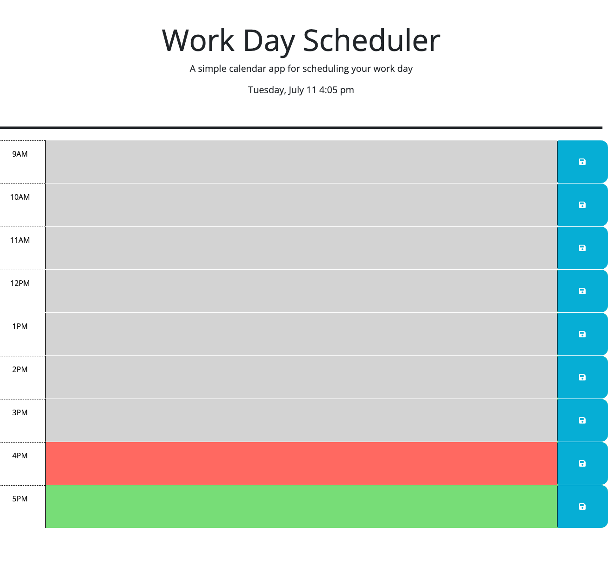

# Work Day Schedule

## My Task
I created this website to provide a reliable color coordinated work day separated by past, present and future; interactive scheduler that allows you to interact with it throughout your workday as well as add additional activities that will be saved in a local storage whether the website fails maintain an internet connection. Once reobtained the activities scheduled will still be present within the local storage!!

## Installation
Created by me using VS Code and starter code provided by the UT Full-stack web development team

## Link to the Repo

https://github.com/Starkoiii/work-day-schedule

## Link to the Site

https://starkoiii.github.io/work-day-schedule/

## Mock-Up

The following animation demonstrates the application functionality:

## Acceptance Criteria Followed
GIVEN I am using a daily planner to create a schedule
WHEN I open the planner
THEN the current day is displayed at the top of the calendar
WHEN I scroll down
THEN I am presented with time blocks for standard business hours of 9am to 5pm
WHEN I view the time blocks for that day
THEN each time block is color-coded to indicate whether it is in the past, present, or future
WHEN I click into a time block
THEN I can enter an event
WHEN I click the save button for that time block
THEN the text for that event is saved in local storage
WHEN I refresh the page
THEN the saved events persist

## How to Contribute
Willing to accept any constructive criticism to improve my future projects or current projects improvements in functionality or style!

© 2023 Starkoiii © 2023